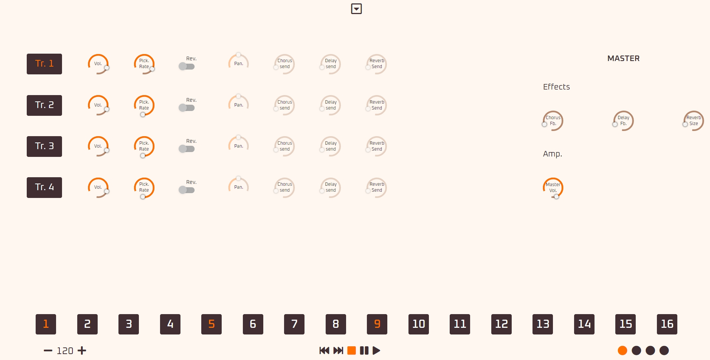

# Machinery

Drum Sequencer built with Tone.js, Vue.js and Vuex.  
Vuex handle clock, sounds routing and sequencer data.



## Project setup
```
npm install
```

### Compiles and hot-reloads for development
```
npm run serve
```

### Compiles and minifies for production
```
npm run build
```

### Lints and fixes files
```
npm run lint
```

### Customize configuration
See [Configuration Reference](https://cli.vuejs.org/config/).
