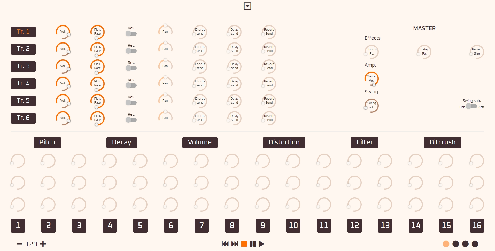

///// Work in progress /////

# Machinery

Drum Sequencer built with Tone.js, Vue.js, Vuex and can be run with electron.
Vuex handle clock, sounds routing and sequencer data.

Inspired by [Elektron](https://www.elektron.se/#) sequencer and [Korg](https://www.korg.com/fr/) products ✨



## Project setup
```
npm install
```

### Compiles and hot-reloads for development
```
With Vue : npm run serve
With electron : npm run electron:serve
```

### Compiles and minifies for production
```
With Vue : npm run build
With electron : npm run electron:build
```

### Lints and fixes files
```
npm run lint
```

### Customize configuration
See [Configuration Reference](https://cli.vuejs.org/config/).

### Built with
```
- [Tone.js](https://tonejs.github.io/)
- [vuepressify](https://github.com/mikqi/vuepressify)
- [round-slider](https://github.com/soundar24/vue-round-slider)
